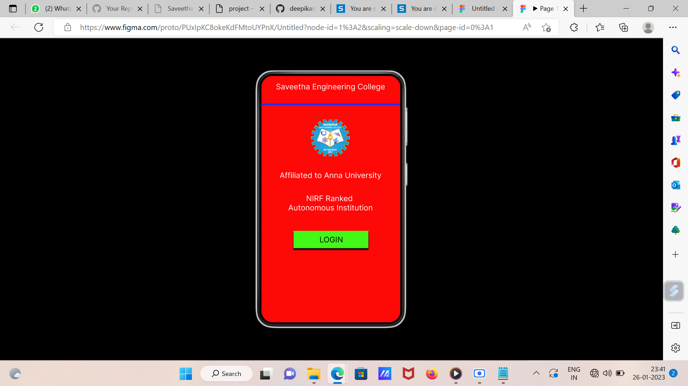
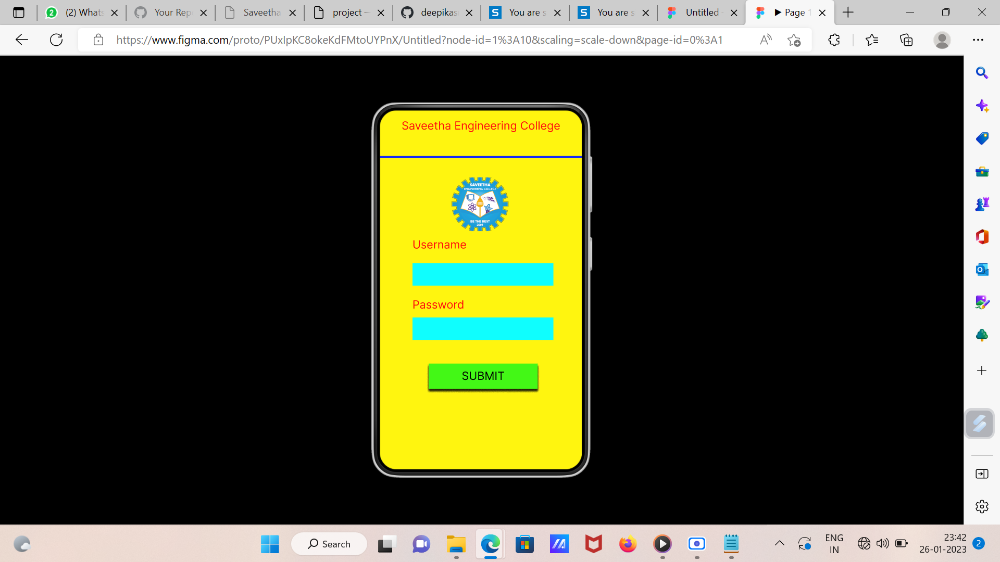
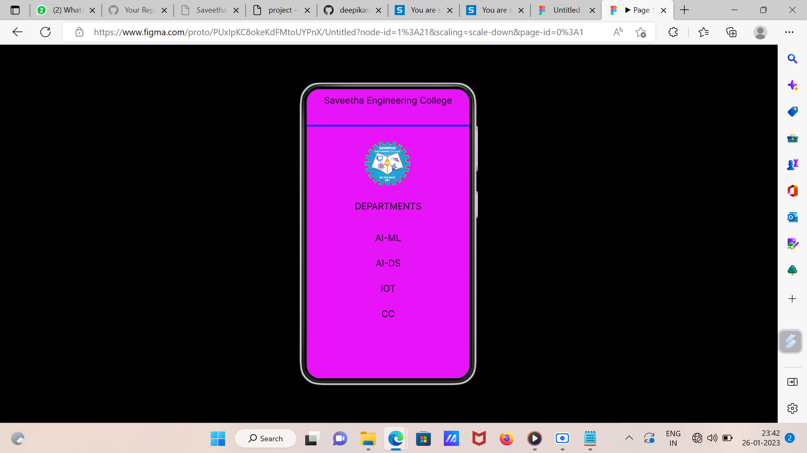

# Event Registration Web Application

## AIM:
To design, develop and deploy a web application for event registration.

## DESIGN STEPS:

### Step 1:
Use Figma Software to start making the UX Design for the Event Registration page

### Step 2:
Choose Android Large as the Screen Type and start laying out the designs as a team of 5 members.

### Step 3:
Design a Home page,Login page,Registration page,Thankyou page and Report page.

### Step 4:
Create a prototype connencting the pages and Run the flow.

### Step 5:
Now the UX design for the Event registrtion page is complete.We can use this design to further develop and deploy a webpage.

### Step 6:
Validate the HTML and CSS code.

### Step 7:
Publish the website in the given URL.

### DESIGN TOOL:
Figma

### code:

/* Home Page */
position: relative;
width: 360px;
height: 640px;
background: #FF0808;

/* Login Page */
position: relative;
width: 360px;
height: 640px;
background: #FFF50F;

/* Saveetha Engineering College */
position: absolute;
width: 324px;
height: 36px;
left: 18px;
top: 13px;
font-family: 'Inter';
font-style: normal;
font-weight: 400;
font-size: 20px;
line-height: 24px;
text-align: center;
color: #101010;

/* DEPARTMENTS */
position: absolute;
width: 324px;
height: 36px;
left: 18px;
top: 247px;
font-family: 'Inter';
font-style: normal;
font-weight: 400;
font-size: 20px;
line-height: 24px;
text-align: center;
color: #101010;

/* AI-ML */
position: absolute;
width: 324px;
height: 36px;
left: 18px;
top: 317px;
font-family: 'Inter';
font-style: normal;
font-weight: 400;
font-size: 20px;
line-height: 24px;
text-align: center;
color: #101010;

/* AI-DS */
position: absolute;
width: 324px;
height: 36px;
left: 18px;
top: 373px;
font-family: 'Inter';
font-style: normal;
font-weight: 400;
font-size: 20px;
line-height: 24px;
text-align: center;
color: #101010;

/* IOT */
position: absolute;
width: 324px;
height: 36px;
left: 18px;
top: 429px;
font-family: 'Inter';
font-style: normal;
font-weight: 400;
font-size: 20px;
line-height: 24px;
text-align: center;
color: #101010;

/* CC */
position: absolute;
width: 324px;
height: 36px;
left: 18px;
top: 485px;
font-family: 'Inter';
font-style: normal;
font-weight: 400;
font-size: 20px;
line-height: 24px;
text-align: center;
color: #101010;

/* Line 3 */
position: absolute;
width: 360px;
height: 0px;
left: 0px;
top: 83px;
border: 4px solid #172DF5;

/* Logo 3 */
position: absolute;
width: 105px;
height: 96px;
left: 127px;
top: 117px;
background: url(Logo.png);

## OUTPUT:

## Result:
The program to design, develop and deploy a web application for event registration is completed successfully.
